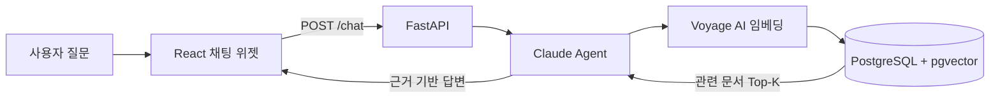
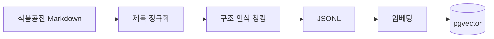

<div align="center">

# 식품공전 AI 챗봇

**식품 기준·규격과 시험법을 자연어로 검색하는 근거 기반 RAG 서비스**

식품공전 문서를 구조화하고 벡터 검색과 LLM을 결합해  
질문에 관련된 규정과 출처를 빠르게 찾아 답변합니다.

`FastAPI` · `React` · `LangChain` · `PostgreSQL/pgvector` · `Claude` · `Voyage AI`

</div>

---

## 프로젝트 소개

식품공전은 식품의 정의, 원료, 제조·가공 기준, 규격 및 시험법을 담고 있지만 문서의 양이 많고 구조가 복잡합니다. 이 프로젝트는 사용자의 자연어 질문과 관련된 문서를 검색하고, 검색된 근거 안에서 답변을 생성하는 챗봇을 제공합니다.

> 이 서비스는 정보 탐색을 돕기 위한 도구입니다. 법적·행정적 판단이 필요한 경우 최신 식품공전과 관계 기관의 공식 해석을 확인해야 합니다.

## 주요 기능

- 식품공전의 계층형 제목과 표 구조를 보존한 문서 전처리
- Voyage AI 임베딩과 pgvector를 이용한 유사도 검색
- 검색 결과에 근거한 Claude 답변 및 출처 분류 경로 제공
- `thread_id`를 이용한 대화 문맥 유지
- FastAPI 기반 비동기 채팅 API
- React 기반 플로팅 채팅 위젯

## 서비스 구조



문서 적재 과정은 다음과 같습니다.



## 기술 스택

| 영역 | 기술 |
| --- | --- |
| Frontend | React 19, Vite 8, Lucide React |
| Backend | Python 3.12, FastAPI, Uvicorn, Pydantic |
| RAG | LangChain, LangGraph |
| LLM | Anthropic Claude Sonnet 4.6 |
| Embedding | Voyage AI `voyage-3-large` |
| Database | PostgreSQL, pgvector |

## 빠른 시작

### 1. 백엔드

```powershell
cd backend
python -m venv .venv
.venv\Scripts\Activate.ps1
pip install -r requirements.txt
```

`backend/.env` 파일을 만들고 API 키를 설정합니다.

```dotenv
ANTHROPIC_API_KEY=your_anthropic_api_key
VOYAGE_API_KEY=your_voyage_api_key
```

PostgreSQL과 pgvector가 준비된 상태에서 서버를 실행합니다.

```powershell
uvicorn main:app --reload
```

- API 문서: <http://127.0.0.1:8000/docs>
- 기본 API 주소: <http://127.0.0.1:8000>

### 2. 프런트엔드

새 터미널에서 다음 명령을 실행합니다.

```powershell
cd frontend
npm install
npm run dev
```

필요하면 `frontend/.env`에서 백엔드 주소를 변경할 수 있습니다.

```dotenv
VITE_API_URL=http://127.0.0.1:8000
```

개발 서버: <http://localhost:5173>

## API 예시

```http
POST /chat
Content-Type: application/json
```

```json
{
  "message": "아이스크림의 식품 유형별 규격을 알려줘",
  "thread_id": "demo-user-1"
}
```

```json
{
  "answer": "검색된 식품공전 근거를 바탕으로 생성된 답변"
}
```

## 프로젝트 구조

```text
foodsafety-ai-chatbot/
├── backend/
│   ├── api/                 # 채팅 API와 요청·응답 모델
│   ├── core/                # 모델, DB, CORS 설정
│   ├── data/                # 원본 Markdown과 청크 JSONL
│   ├── model/               # 임베딩 및 DB 연결
│   ├── rag/                 # 전처리, 적재, 검색, 에이전트
│   ├── sql/                 # 식품공전 관련 SQL
│   └── main.py              # FastAPI 진입점
├── frontend/
│   ├── public/              # 정적 리소스
│   └── src/                 # React 애플리케이션
└── README.md
```

더 자세한 실행 방법은 [백엔드 문서](backend/README.md)와 [프런트엔드 문서](frontend/README.md)를 참고하세요.

## 현재 범위와 향후 과제

현재 검색은 Dense Vector Search를 기반으로 하며 메모리 체크포인터를 사용합니다. 다음 항목은 향후 개선 대상입니다.

- BM25와 벡터 검색을 결합한 Hybrid Search
- Query rewriting/decomposition 및 reranking
- 검색·답변 품질을 측정하는 평가 데이터셋과 지표
- 영속 대화 저장소, 인증, 요청 제한
- 공식 데이터 변경을 반영하는 자동 동기화

## 라이선스 및 데이터

저장소에는 별도의 라이선스가 명시되어 있지 않습니다. 재사용 또는 배포 전 코드 라이선스와 원문 데이터의 이용 조건을 확인하세요.
