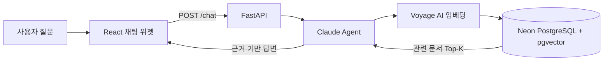
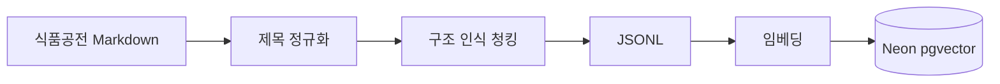

<div align="center">

# 식품공전 AI 챗봇

**식품 기준·규격과 시험법을 자연어로 검색하는 근거 기반 RAG 서비스**

식품공전 문서를 구조화하고 벡터 검색과 LLM을 결합해  
질문에 관련된 규정과 출처를 빠르게 찾아 답변합니다.

`FastAPI` · `React` · `LangChain` · `Neon PostgreSQL/pgvector` · `Claude` · `Voyage AI`

</div>

---

## 프로젝트 소개

식품공전은 식품의 정의, 원료, 제조·가공 기준, 규격 및 시험법을 담고 있지만 문서의 양이 많고 구조가 복잡합니다. 이 프로젝트는 사용자의 자연어 질문과 관련된 문서를 검색하고, 검색된 근거 안에서 답변을 생성하는 챗봇을 제공합니다.

> 이 서비스는 정보 탐색을 돕기 위한 도구입니다. 법적·행정적 판단이 필요한 경우 최신 식품공전과 관계 기관의 공식 해석을 확인해야 합니다.

## 주요 기능

- 식품공전의 계층형 제목과 표 구조를 보존한 문서 전처리
- Voyage AI 임베딩과 pgvector를 이용한 유사도 검색
- 검색 결과에 근거한 Claude 답변 및 출처 분류 경로 제공
- `thread_id`를 이용한 대화 문맥 유지
- FastAPI 기반 비동기 채팅 API
- React 기반 플로팅 채팅 위젯

## 서비스 구조



문서 적재 과정은 다음과 같습니다.



## 기술 스택

| 영역 | 기술 |
| --- | --- |
| Frontend | React 19, Vite 8, Lucide React |
| Backend | Python 3.12, FastAPI, Uvicorn, Pydantic |
| RAG | LangChain, LangGraph |
| LLM | Anthropic Claude Sonnet 4.6 |
| Embedding | Voyage AI `voyage-3-large` |
| Database | Neon PostgreSQL, pgvector |

## 클론부터 실행까지

이 저장소에는 백엔드와 프런트엔드가 함께 들어 있습니다. 저장소를 한 번만 클론한 뒤 두 애플리케이션을 각각 실행하면 됩니다.

### 사전 준비

- Git
- Python 3.12 이상
- Node.js와 npm
- Neon 프로젝트 또는 공유받은 Neon DB 접근 권한
- Anthropic API 키
- Voyage AI API 키

### 1. 저장소 클론

```powershell
git clone https://github.com/hyyang9070/foodsafety-ai-chatbot.git
cd foodsafety-ai-chatbot
```

### 2. 백엔드 설치

```powershell
cd backend
python -m venv .venv
.\.venv\Scripts\Activate.ps1
python -m pip install --upgrade pip
pip install -r requirements.txt
```

macOS 또는 Linux에서는 다음 명령으로 가상환경을 활성화합니다.

```bash
source .venv/bin/activate
```

### 3. 백엔드 환경 변수 설정

`backend/.env` 파일을 만들고 API 키를 입력합니다.

```dotenv
DATABASE_URL=postgresql://[user]:[password]@[neon-hostname]/[database]?sslmode=require&channel_binding=require
ANTHROPIC_API_KEY=your_anthropic_api_key
VOYAGE_API_KEY=your_voyage_api_key
```

Neon 콘솔의 프로젝트 화면에서 **Connect**를 눌러 연결 문자열을 복사할 수 있습니다. `.env`에는 DB 비밀번호가 포함되므로 Git에 커밋하거나 다른 사람에게 공개하지 않습니다.

### 4. Neon PostgreSQL 및 pgvector 준비

Neon 콘솔의 **SQL Editor**에서 대상 데이터베이스를 선택하고 pgvector 확장을 한 번만 활성화합니다.

```sql
CREATE EXTENSION IF NOT EXISTS vector;
```

`DATABASE_URL`에는 Neon이 제공하는 연결 문자열을 그대로 넣을 수 있습니다. 백엔드는 `postgresql://` 접두사를 SQLAlchemy의 psycopg 3 형식으로 자동 변환합니다.

> 팀의 기존 Neon DB에 `foodsafety_fd_cd` 테이블과 데이터가 이미 있다면 확장 활성화, 테이블 초기화 및 `rag.load`를 다시 실행하지 않아도 됩니다. 연결 문자열만 설정하면 됩니다.

### 5. 식품공전 데이터 전처리 및 Neon 적재

아래 명령은 모두 가상환경이 활성화된 `backend` 디렉터리에서 실행합니다.

먼저 `data/md/*.md` 원본을 검색 가능한 청크로 전처리합니다.

```powershell
python -m rag.preprocessor
```

전처리 흐름은 다음과 같습니다.

```text
data/md/*.md
    → 제목 계층 정규화 및 문서 청킹
    → data/doc.jsonl 생성
```

명령이 끝나면 파일별 청크 수와 전체 청크 수가 출력되고 `backend/data/doc.jsonl`이 생성됩니다.

완전히 새로 만든 Neon DB라면 `foodsafety_fd_cd` 벡터 테이블을 한 번만 초기화합니다. 현재 사용하는 `voyage-3-large`의 기본 임베딩 차원은 1,024입니다.

```powershell
python -c "from langchain_postgres import PGEngine; from core.config import CONNECTION_STRING; engine = PGEngine.from_connection_string(url=CONNECTION_STRING); engine.init_vectorstore_table(table_name='foodsafety_fd_cd', vector_size=1024)"
```

이미 `foodsafety_fd_cd` 테이블이 있는 Neon DB에서는 이 초기화 명령을 건너뜁니다. 이제 JSONL의 각 청크를 Voyage AI로 임베딩하고 Neon에 적재합니다.

```powershell
python -m rag.load
```

적재가 완료되면 Neon의 `foodsafety_fd_cd` 테이블에 데이터가 저장되고 완료 건수가 출력됩니다. Neon SQL Editor에서 다음 쿼리로 확인합니다.

```sql
SELECT COUNT(*) AS document_count FROM foodsafety_fd_cd;
SELECT extversion FROM pg_extension WHERE extname = 'vector';
```

> `rag.load`는 Voyage AI API를 사용하므로 `VOYAGE_API_KEY`가 먼저 설정되어 있어야 합니다. 팀원이 같은 Neon DB에 적재 명령을 반복하면 문서가 중복될 수 있으므로 DB 담당자 한 명만 최초 구성 또는 의도적인 재구축 시 실행하세요.

모든 사용자가 같은 `DATABASE_URL`을 사용하면 각 PC의 로컬 DB가 아니라 하나의 Neon 클라우드 DB를 공유합니다. 개인별 DB가 필요하면 각자 Neon 프로젝트나 브랜치를 만든 뒤 위 과정을 실행해야 합니다.

테이블 초기화 방식은 [LangChain PostgreSQL 공식 예제](https://github.com/langchain-ai/langchain-postgres#vectorstore), 임베딩 차원은 [Voyage AI 공식 문서](https://docs.voyageai.com/docs/embeddings)를 기준으로 합니다.

### 6. 백엔드 실행

`backend` 디렉터리에서 실행합니다.

```powershell
uvicorn main:app --reload
```

- 백엔드 API: <http://127.0.0.1:8000>
- Swagger UI: <http://127.0.0.1:8000/docs>

### 7. 프런트엔드 설치 및 실행

백엔드를 실행한 상태로 **새 터미널**을 열고, 클론한 프로젝트의 `frontend` 디렉터리로 이동합니다.

```powershell
cd foodsafety-ai-chatbot\frontend
npm install
npm run dev
```

터미널이 이미 프로젝트 루트에서 열렸다면 `cd frontend`만 실행하면 됩니다.

백엔드 주소를 변경해야 한다면 `frontend/.env` 파일을 생성합니다.

```dotenv
VITE_API_URL=http://127.0.0.1:8000
```

환경 변수가 없으면 `http://127.0.0.1:8000`을 사용합니다. 값을 변경한 후에는 Vite 개발 서버를 다시 시작해야 합니다.

### 8. 실행 확인

| 구분 | 실행 명령 | 접속 주소 |
| --- | --- | --- |
| Backend | `uvicorn main:app --reload` | <http://127.0.0.1:8000/docs> |
| Frontend | `npm run dev` | <http://localhost:5173> |

Vite가 `5173`이 아닌 다른 포트를 사용하면 `backend/core/config.py`의 `CORS_ORIGINS`에도 해당 주소를 추가해야 합니다.

## API 예시

```http
POST /chat
Content-Type: application/json
```

```json
{
  "message": "아이스크림의 식품 유형별 규격을 알려줘",
  "thread_id": "demo-user-1"
}
```

```json
{
  "answer": "검색된 식품공전 근거를 바탕으로 생성된 답변"
}
```

## 프로젝트 구조

```text
foodsafety-ai-chatbot/
├── backend/
│   ├── api/                 # 채팅 API와 요청·응답 모델
│   ├── core/                # 모델, DB, CORS 설정
│   ├── data/                # 원본 Markdown과 청크 JSONL
│   ├── model/               # 임베딩 및 DB 연결
│   ├── rag/                 # 전처리, 적재, 검색, 에이전트
│   ├── sql/                 # 식품공전 관련 SQL
│   └── main.py              # FastAPI 진입점
├── frontend/
│   ├── public/              # 정적 리소스
│   └── src/                 # React 애플리케이션
└── README.md
```

더 자세한 실행 방법은 [백엔드 문서](backend/README.md)와 [프런트엔드 문서](frontend/README.md)를 참고하세요.

## 현재 범위와 향후 과제

현재 검색은 Dense Vector Search를 기반으로 하며 메모리 체크포인터를 사용합니다. 다음 항목은 향후 개선 대상입니다.

- BM25와 벡터 검색을 결합한 Hybrid Search
- Query rewriting/decomposition 및 reranking
- 검색·답변 품질을 측정하는 평가 데이터셋과 지표
- 영속 대화 저장소, 인증, 요청 제한
- 공식 데이터 변경을 반영하는 자동 동기화

## 라이선스 및 데이터

저장소에는 별도의 라이선스가 명시되어 있지 않습니다. 재사용 또는 배포 전 코드 라이선스와 원문 데이터의 이용 조건을 확인하세요.
